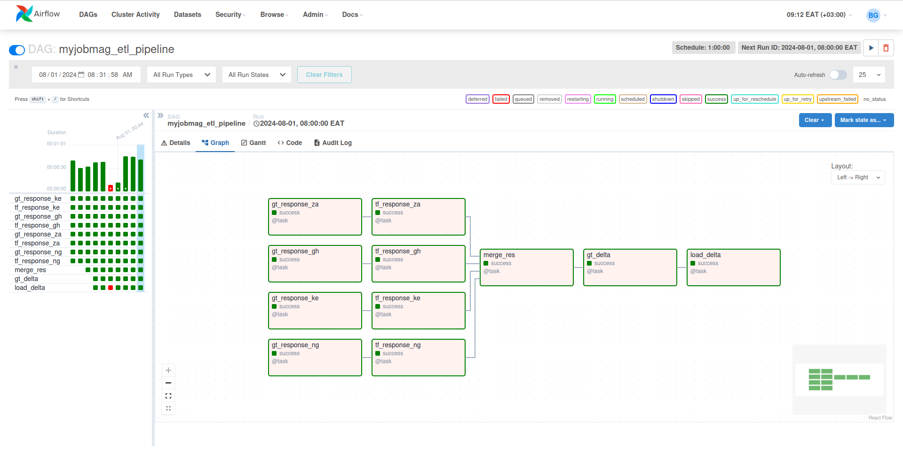
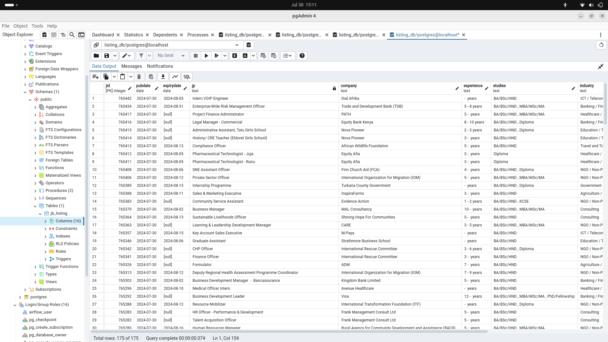
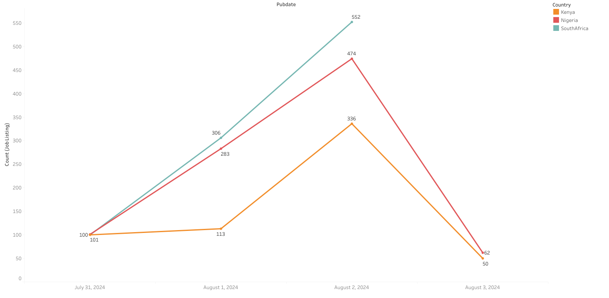

# Simple_Airflow_Pipeline
#### Project Brief 

Scrap xml data feed   
Parse the xml feed   
Transform   
Load to PostgreSQL database    
Orchestration - Apache Airflow

**Code**   
[.py elt_code](elt_pipeline.py)     

     

     

   

Resources   
XML FEEDs - URLs   

[Kenya RSS Feed - https://www.myjobmag.co.ke/aggregate_feed.xml](https://www.myjobmag.co.ke/aggregate_feed.xml)        
[Ghana RSS Feed - https://www.myjobmagghana.com/aggregate_feed.xml](https://www.myjobmagghana.com/aggregate_feed.xml)   
[South Africa RSS Feed - https://www.myjobmag.co.za/aggregate_feed.xml](https://www.myjobmag.co.za/aggregate_feed.xml)    
[Nigeria RSS Feed- https://www.myjobmag.com/aggregate_feed.xml](https://www.myjobmag.com/aggregate_feed.xml)   

# Areas of Improvement
### Pandas Chaining Method
Chaining method is a way to join multiple operations in concise and expressive way.   
It allows us to link together a sequence of transformation and cleaning steps.   
Example of chaining method  
```
def alter(df):
    df = (response
           .drop("salary", axis=1)
           .drop_duplicates("link", keep='first')
           .rename({"id":"jid"}, axis=1)
           .astype({"jid":"int64","pubDate":"datetime64[ns]"})
           .sort_values("jid", ascending=False)
           .query("jid > 768100")
           .assign(country="Kenya")
           .assign(trial= lambda x:x.jid*10))
    return df
alter(df)
```

